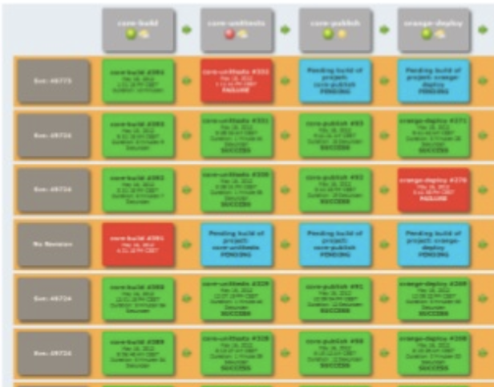

title: Build pipelines that don't suck
class: animation-fade
layout: true

<!-- This slide will serve as the base layout for all your slides -->

---

class: impact

# {{title}}

???

- Do you have build pipelines for your software? Probably yes
- Pipelines are often an afterthought, and thus of poor quality
- How do you justify spending resources on improving pipelines?

---

class: center middle

# It is about Continuous Delivery

???

- A pipeline is a mean to an end
- end goal is delivering software quickly, safely, in a sustainable way

---

# Four key metrics

.col-6[

- Lead time
- Deployment frequency
- Mean time to restore
- Change fail percentage
]

.col-6[

]

https://www.thoughtworks.com/radar/techniques/four-key-metrics

???

- There is *science!* behind it

---

class: middle

- Lead time
- **Deployment frequency**
- Mean time to restore
- **Change fail percentage**

???

- Arguably every metric benefits from a solid pipeline, but these two are particularly so

---

class: transition

# Before we talk about pipelines...

---

class: center middle

# CI/CD is not an antidote for your dysfunction

???

- Before moving to how to build pipelines better, I want to talk about my first experience implementing CD 

---

# Ice-cream cone

Picture: reverse testing pyramid

???

- barely any unit tests
- instead, a massive suite of incredibly flaky e2e tests, supported by around ~25 slaves retrying tests non stop

---

class: center middle

# A link to the past



???

- 2012, first time I heard about Continuous Delivery
- Built a pipeline using the old jenkins plugin
- Hilariously painful

---

class: transition

# Our target

---

class: full-width
background-image: url(images/pipeline.png)

---

class: impact

# A good pipeline is ...

???

- These are my own criteria
- Would be interesting to hear about others later

---

class: transition

# A good pipeline *is* code

---

class: center middle

 https://www.gocd.org/2017/05/02/what-does-pipelines-as-code-really-mean/
 
---

```yaml
- name: test
  serial: true
  plan:
  - aggregate:
    - get: git
      passed: [prepare]
      trigger: true
    - get: dev-container
      passed: [prepare]
  - task: test-js
    image: dev-container
    params:
      <<: *common-params
      TARGET: js
    file: git/pipeline/tasks/tests/task.yml
```

---

```yaml
jobs:
  build:

    working_directory: ~/app

    docker:
      - image: circleci/node:11.10.1

    steps:

      - checkout
      - run: yarn
      - run: yarn run linter:js
      - run: yarn run linter:css
      - run: yarn run linter:text
      - run: yarn test --coverage --runInBand
```

---

class: bad-practice center middle

## Don't modify it through a UI

---

class: center middle

## Keep it close to the app

---

class: center middle

## Keep it versioned

???

- goes without saying
- has a second meaning: don't export it from somewhere else and put in a repo

---

class: transition

# A good pipeline is maintainable

---

class: center middle

## Declarative

---

- Picture: dependency map

---

class: center middle

## _Not_ a full blown programming language

???

- Current project had a _Gradle_ based DSL that was basically impossible to test

---

class: center middle

## Locally executable
### https://www.thoughtworks.com/insights/blog/praise-go-script-part-i

???

- There are always limits. Doing a deployment might not be something you want to do locally

---

```console
./go
usage: ./go <goal>

  goal:

  linter-js                -- Run the linter for js files
  linter-css               -- Run the linter for css files
  linter-html              -- Run the linter for html files
  linter                   -- Run all linters

  test-js                  -- Run unit tests
  
  audit                    -- Audit packages
  
  e2e                      -- Run end to end tests

  build                    -- Build the bundle
```

---

```console
goal_test-js() {
  export MAPS_KEY=${MAPS_KEY:-$(gopass store/map-key)}
  npm t
}
```

```console
goal_build() {
  gradle_with_credentials build -x test
}

gradle_with_credentials() {
  if [ -z "$USER" ] || [ -z "$PASSWORD" ]; then
    ./gradlew "$@"
  else
    ./gradlew -Puser=$USER -Ppassword=$PASSWORD "$@"
  fi
}
```

???

- Using docker for local execution can be an alternative as well

---

class: transition

# A good pipeline is reliable

---

class: center middle

## Isolation

???

- Pretty much the opposite of persistent workspaces in Jenkins

---

class: center middle


???

- You can even test the containers using TDD

---

```Dockerfile
FROM node:11.11-stretch

SHELL ["/bin/bash", "-o", "pipefail", "-c"]

RUN apt-get update && \
  apt-get -y install --no-install-recommends \
  # Chrome
  libx11-xcb1 libxcomposite1 libxcursor1 libxdamage1 libxi6 libxtst6 \
  libnss3 libxss1 libcups2 libxrandr2 libasound2 \ 
  libatk1.0-0 libatk-bridge2.0-0 libgtk-3-0 \
  sudo curl shellcheck unzip rsync jq && \
  apt-get clean && \
  rm -rf /var/lib/apt/lists/*
```

---

class: center middle

## Rely on standard tools
### sh, sed, jq, ...

---

class: center middle

## *Tradeoff*: Isolation and speed

---

class: center middle

## Beware of external systems

---

class: transition

# A good pipeline is fast

---

class: center middle

## Throw hardware at the problem

---

class: center middle

## Up-to-date dependencies

---

class: center middle

.col-6[

]
.col-6[

]

---

class: center middle

## Parallelization

---

class: full-width concourse
background-image: url(images/parallel.png)

---

class: center middle

## Order of execution
### Avoid repeating steps

---

class: center middle

## Caching

???

- Caching and avoiding repetition are not the same thing

---

```yaml
platform: linux
inputs:
  - name: git
  - name: shared-tasks
caches:
  - path: git/node_modules
```

```yaml
platform: linux
inputs:
  - name: git
caches:
  - path: gradle
params:
  GRADLE_USER_HOME: ../gradle
```

---

class: transition

# A good pipeline is visual

---

class: center middle bad-practice

## The god-step

---

class: full-width circle
background-image: url(images/fatstep.png)

---

class: center middle

## Figure out what went wrong

---

class: center middle

## Visualize dependencies

???

- Can your CI/CD tool make _all_ dependencies transparent?

---

class: center middle

## Logging overdose

---

class: full-width concourse
background-image: url(images/logging.png)

---

class: transition

# A good pipeline is scalable

---

class: full-width concourse
background-image: url(images/all-pipelines.png)

---

class: center middle

## *Tradeoff*: Reuse vs Coupling

---

class: center middle

## Follow a similar structure

---

class: center middle

## Parametrized steps

---

```yaml
platform: linux
inputs:
  - name: git
  - name: shared-tasks
caches:
  - path: git/node_modules
params:
  TARGET:
run:
  path: sh
  dir: git
  args:
  - -ec
  - |
    ../shared-tasks/scripts/install-yarn-packages.sh
    ./go linter-${TARGET}
```

---

class: center middle

## Shared containers

---

class: full-width concourse
background-image: url(images/containers.png)

---

class: center middle

## Don't package dependencies in the containers

---

class: middle

# Summary
## A good pipeline is ...

- code
- maintainable
- reliable
- fast
- visual
- scalable

---

class: transition

# Tell me what CI/CD tool to use!

---

class: center middle

## It is not that important

---

class: center middle

# It won't be for lack of options
## [Top Continuous Integration Tools: 51 Tools to Streamline Your Development Process, Boost Quality, and Enhance Accuracy](https://stackify.com/top-continuous-integration-tools/)

---

class: transition

# Let's finish with a quote

---

class: center middle

> You know what I love? Spending more time retrying jobs until the build is green than building the *damn* feature itself

*Nobody, ever*

---

class: impact center middle

## Mario Fernandez
 Lead Developer
 
 **Thought**Works
